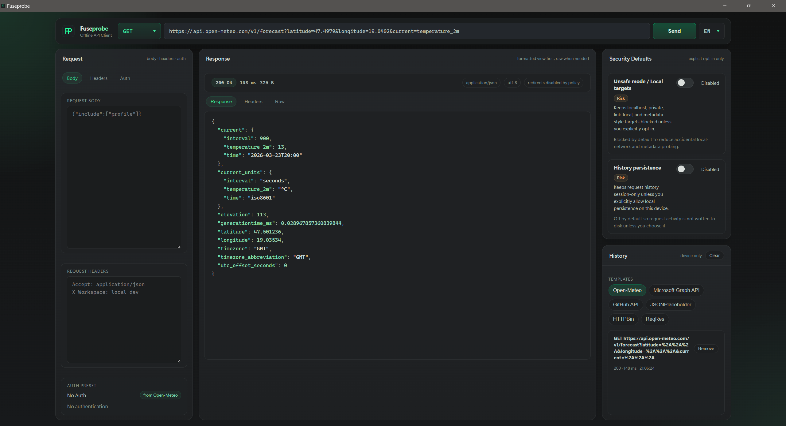

# Fuseprobe

**Security-first offline API workbench for desktop**

Fuseprobe is a local-first desktop API client for deliberate request work. It runs as a Tauri app with a React/Vite UI and a Rust request core, with no cloud workspace model layered on top.




Source-available for noncommercial use. Commercial use requires permission.

## Download for Windows

The intended end-user install path is the release installer, not a source build.

- download the latest Windows installer from [GitHub Releases](https://github.com/goAuD/Fuseprobe/releases)
- use the `Fuseprobe_*_x64-setup.exe` asset
- when a companion `*.sha256` asset is present, verify the installer hash before distributing it further
- install it, then launch Fuseprobe from the installed shortcut or Start menu

Current Windows installers are not code-signed yet, so SmartScreen may still show an unknown publisher warning.

If you only want to use Fuseprobe, stop here. The source-build path below is for contributors and local development.

## What Fuseprobe Is

Fuseprobe is a focused desktop request workbench for:

- sending HTTP requests without cloud services
- inspecting formatted, header, and raw responses
- testing auth/header combinations quickly
- working with strict security defaults on local machines
- keeping sensitive request activity off disk unless you explicitly allow it

It is intentionally not a cloud workspace, team collaboration suite, or Postman clone.

## Current Product Status

The canonical app is the `Tauri + React/Vite + Rust` desktop shell in `apps/desktop/`.

Current verified status:

- Windows desktop release-candidate build verified
- desktop shell localization is implemented for `en / de / hu`, including persisted locale selection and localized warnings/response metadata
- current desktop shell tuning favors a calmer low-glare palette and a denser first-screen layout for day-to-day use
- cross-platform packaging remains a product goal, but is not documented here as already verified
- the legacy desktop shell is no longer part of the mainline repository

## Core Features

- **Offline-first desktop app**: runs locally without cloud dependency
- **Security-first request policy**: strict defaults for local/private targets
- **Formatted response workflow**: switch between response, headers, and raw views
- **Auth presets**: No Auth, Bearer, Basic, API Key header, API Key authorization
- **API templates**: Open-Meteo, Microsoft Graph, GitHub, JSONPlaceholder, HTTPBin, ReqRes
- **Rust request core**: request validation, policy enforcement, response classification, history redaction
- **Session-first history**: request history stays in-memory unless you explicitly enable persistence
- **Desktop security controls**: persisted toggles with confirmations for risky settings
- **Localized desktop shell**: production-ready English, German, and Hungarian UI copy with persisted locale selection
- **Low-glare shell tuning**: calmer syntax colors, softer bright text, and tighter viewport fit on first launch

## Security Defaults

Fuseprobe is intentionally strict by default:

- `Unsafe mode / Local targets` is off
- localhost, private IPs, link-local targets, and metadata-style endpoints are blocked by default
- hostnames that cannot be resolved during request validation fail closed instead of bypassing the target policy
- `History persistence` is off
- risky settings require explicit confirmation before they switch on

These are deliberate product decisions, not missing features.

Public-facing usage and security notes live here:

- [usage-and-security.md](docs/usage-and-security.md)

## Use Cases

### Backend development

- verify endpoints before wiring frontend code
- inspect real responses without browser tooling noise
- test auth/header combinations quickly

### Security-oriented API testing

- use a local desktop client with explicit unsafe-target controls
- keep history session-only on sensitive machines
- inspect raw headers and bodies while preserving strict defaults

### Learning and demos

- explore public APIs in a simpler tool than heavyweight API platforms
- demonstrate HTTP methods, headers, auth presets, and response inspection
- show request/response flows in a desktop app without cloud setup

## Build From Source

This section is for contributors and local source builds.

### Building from source

- Node.js 20+
- npm 10+
- Rust stable toolchain
- Windows source builds also require `Visual Studio Build Tools 2022`
- install the `Desktop development with C++` workload
- make sure `MSVC v143` and a `Windows 10/11 SDK` are included
- Microsoft Edge WebView2 runtime is also part of the Windows desktop stack for Tauri apps

## Source Checkout

```bash
git clone https://github.com/goAuD/Fuseprobe.git
cd Fuseprobe
```

All commands below assume your current working directory is the repository root, where `apps/desktop/package.json` exists.

## Run Locally

To launch the app for development, use the Tauri dev command:

```bash
npm --prefix apps/desktop install
npm --prefix apps/desktop run tauri:dev
```

Use this when you want the desktop app window to open locally with the live frontend/Rust dev loop.

## Build a Windows Package

`build` compiles the frontend only. It does not launch the desktop app.

```bash
npm --prefix apps/desktop run build
```

To build the actual Windows desktop executable and NSIS installer, use:

```bash
npm --prefix apps/desktop run tauri:build
```

Preferred Windows distribution artifact:

- `target/release/bundle/nsis/Fuseprobe_3.0.3_x64-setup.exe`
- on tagged releases, the workflow also emits a companion `*.sha256` checksum file for installer verification

The raw binary at `target/release/fuseprobe-desktop.exe` is a development/build artifact. It is not the recommended distribution target for other machines.

### Windows build prerequisites

If you are building Fuseprobe from source on Windows, install these before trying `tauri:dev` or `tauri:build`:

1. Rust stable toolchain
2. Node.js and npm
3. Visual Studio Build Tools 2022
4. `Desktop development with C++`
5. `MSVC v143` toolset
6. `Windows 10/11 SDK`
7. Microsoft Edge WebView2 Runtime if it is not already present on that machine

Without the C++ build workload, the Tauri/Rust desktop build can fail with Windows linker errors such as `link.exe` failures during dependency compilation.

Tauri's current prerequisites state that WebView2 is already installed on Windows 10 (from version 1803 onward) and Windows 11, but it is still worth calling out explicitly because desktop app startup depends on it. Sources:

- [Tauri prerequisites](https://v2.tauri.app/start/prerequisites/)
- [Tauri Windows installer docs](https://v2.tauri.app/distribute/windows-installer/)

After installing the Microsoft build tools, open a fresh shell. On some Windows setups the safest option is to use:

- `Developer PowerShell for VS 2022`
- or `x64 Native Tools Command Prompt for VS 2022`

Those shells initialize the MSVC build environment so tools such as `cl`, `link`, `rc`, and `mt` are available on `PATH`.

## Verify A Release Installer

When a release includes a companion `*.sha256` asset, you can verify the installer before running it:

```powershell
Get-FileHash .\Fuseprobe_3.0.3_x64-setup.exe -Algorithm SHA256
```

Compare the printed hash with the contents of the matching `.sha256` release asset.

## Running Fuseprobe

1. Launch the desktop shell with `npm --prefix apps/desktop run tauri:dev`
2. Choose the request method
3. Enter the request URL
4. Optionally add request body and headers
5. Optionally apply a template preset
6. Review the response in formatted, headers, or raw view
7. Use the security panel for explicit opt-in settings when needed

### Running the packaged Windows app

After `npm --prefix apps/desktop run tauri:build`, install and launch Fuseprobe from the generated NSIS setup executable:

1. Open `target/release/bundle/nsis/`
2. Run the generated `*-setup.exe`
3. Launch Fuseprobe from the installed desktop/start-menu entry

This is the intended Windows delivery path.

## Templates and Auth Presets

### Auth presets

| Preset | Purpose |
| --- | --- |
| No Auth | No authentication headers |
| Bearer Token | JWT / OAuth2 bearer token workflows |
| Basic Auth | Base64 username/password auth |
| API Key (Header) | `X-Api-Key` header pattern |
| API Key (Authorization) | `Authorization: ApiKey ...` pattern |

### API templates

| Template | Base URL |
| --- | --- |
| Open-Meteo | `https://api.open-meteo.com/v1` |
| Microsoft Graph API | `https://graph.microsoft.com/v1.0` |
| GitHub API | `https://api.github.com` |
| JSONPlaceholder | `https://jsonplaceholder.typicode.com` |
| HTTPBin | `https://httpbin.org` |
| ReqRes | `https://reqres.in/api` |

## Data Storage

Default behavior:

- request history is session-only
- nothing is written to disk unless `History persistence` is enabled

When history persistence is enabled:

- redacted history is stored under the local Fuseprobe app config directory
- security settings are stored there as well
- fragments are removed
- query values are redacted before persistence
- request bodies and headers are never persisted

Fuseprobe can still read prior local Fuseprobe state from older per-user storage locations when present.

## Project Structure

```text
Fuseprobe/
├── apps/
│   └── desktop/                # Canonical Tauri + React/Vite desktop shell
├── crates/
│   └── fuseprobe-core/         # Shared Rust request/history/security core
├── assets/
│   ├── fuseprobe.png           # README screenshot
│   └── fuseprobe_social.png    # Social preview asset
├── docs/
│   ├── releases/               # Release notes and release drafts
│   ├── usage-and-security.md   # User-facing security guidance
│   └── plans/                  # Architecture, migration, roadmap, packaging docs
├── apps/desktop/public/        # Temporary desktop mark/favicon assets
├── Cargo.toml                  # Rust workspace root
├── CHANGELOG.md
├── LICENSE
└── COMMERCIAL-USE.md
```

## Troubleshooting

### The app does not start and I used `npm --prefix apps/desktop run build`

- `npm --prefix apps/desktop run build` only builds the frontend bundle
- it does not open the desktop app
- for local desktop runtime use `npm --prefix apps/desktop run tauri:dev`
- for a packaged executable use `npm --prefix apps/desktop run tauri:build` and then launch the generated installer or built app

### “Invalid or unsafe URL”

- use `http://` or `https://`
- check for malformed URLs or whitespace
- if you intentionally need `localhost` or private targets, enable `Unsafe mode / Local targets`

### History is empty after restart

- this is expected if `History persistence` is still off
- enable it only if you explicitly want local persistence on that device

### Slow startup in development

- `tauri:dev` includes frontend dev-server and Rust rebuild overhead
- compare against the packaged release build before treating it as a runtime bug

### Packaged app does not start on another Windows machine

- use the NSIS setup executable from `target/release/bundle/nsis/`, not the raw `target/release/fuseprobe-desktop.exe`
- the setup executable can install the required WebView2 runtime when it is missing
- if you run the raw exe directly, Windows WebView2 availability on that machine becomes your problem instead of Fuseprobe's installer handling it
- first launch can still be delayed by SmartScreen or antivirus scanning on unsigned builds

### `npm --prefix apps/desktop install` fails with `ENOENT`

- make sure you are in the repository root before running the command
- verify that `apps/desktop/package.json` exists from your current shell location
- if it does not exist, you are in the wrong folder or did not open the cloned repo root
- the direct fallback is:

```bash
cd Fuseprobe/apps/desktop
npm install
```

### `tauri:dev` or `tauri:build` fails with `link.exe` / MSVC errors

- this is usually a missing Windows native build prerequisite, not an npm dependency issue
- install `Visual Studio Build Tools 2022`
- enable `Desktop development with C++`
- include `MSVC v143` and a `Windows 10/11 SDK`
- after installation, close the terminal, open a new one, and run the desktop commands again
- on some systems you should launch `Developer PowerShell for VS 2022` or `x64 Native Tools Command Prompt for VS 2022` instead of a plain PowerShell window
- if `where.exe cl`, `where.exe link`, `where.exe rc`, and `where.exe mt` still return nothing, the MSVC environment is not initialized correctly yet

### Response is not formatted as JSON

- the response must be recognized as JSON
- very large formatted responses may fall back to plain view for responsiveness
- binary responses intentionally avoid text formatting

## Running Tests

```bash
npm --prefix apps/desktop test -- --run
npm --prefix apps/desktop run build
cargo test
```

## Release Notes

- [release-v2.1.0.md](docs/releases/release-v2.1.0.md)
- [release-v3.0.0.md](docs/releases/release-v3.0.0.md)
- [release-v3.0.1.md](docs/releases/release-v3.0.1.md)
- [release-v3.0.2.md](docs/releases/release-v3.0.2.md)
- [release-v3.0.3.md](docs/releases/release-v3.0.3.md)

## License

Current branch and future versions are licensed under PolyForm Noncommercial 1.0.0.

`v2.1.0` and earlier released tags remain under their original MIT license terms.

See [COMMERCIAL-USE.md](COMMERCIAL-USE.md) for commercial-use notes.

For commercial licensing or exceptions, open a GitHub issue.
